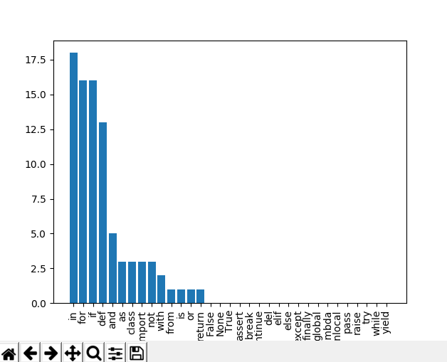

# codestats
Statistics for your code

Currently generates stats for: 
- Number of keywords

Currently supports: 
- Python 
- C++

```
usage: codestats.py [-h] [--exclude EXCLUDE [EXCLUDE ...]] [-f] [--lang LANG]
                    [--wdir WDIR]
                    dir [dir ...]

Generates statistics from code files

positional arguments:
  dir                   Files to parse

optional arguments:
  -h, --help            show this help message and exit
  --exclude EXCLUDE [EXCLUDE ...]
                        Files/Directories to exclude
  -f                    Specifies that the directory is a folder and not a
                        file.
  --lang LANG           Language to parse. Currently supported: Python and C++
  --wdir WDIR           Changes the working directory
  ```
  
  # Examples
  
## Parse all the files in the current directory
```
>codestats.py .

Args:  {'dir': ['.'], 'exclude': None, 'f': False, 'lang': 'python', 'wdir': None}
Getting every file in the directory...
Starting the parsing of files
Finished reading all files
Starting analysis
.  --> Done
.\codestats.py  --> Done
{'in': 18, 'for': 16, 'if': 16, 'def': 13, 'and': 5, 'as': 3, 'class': 3, 'import': 3, 'not': 3, 'with': 2, 'from': 1, 'is': 1, 'or': 1, 'return': 1, 'False': 0, 'None': 0, 'True': 0, 'assert': 0, 'break': 0, 'continue': 0, 'del': 0, 'elif': 0, 'else': 0, 'except': 0, 'finally': 0, 'global': 0, 'lambda': 0, 'nonlocal': 0, 'pass': 0, 'raise': 0, 'try': 0, 'while': 0, 'yield': 0}
Number of lines:  172
```
And we get a nice graph



## Parse all the files in another directory
```
>codestats.py "C:\Users\zxc\Desktop\programs" -f

Args:  {'dir': ['C:\\Users\\zxc\\Desktop\\programs'], 'exclude': None, 'f': True, 'lang': 'python', 'wdir': None}
Getting every file in the directory...
Starting the parsing of files
Finished reading all files
Starting analysis

...

{'def': 308, 'if': 304, 'in': 169, 'for': 157, 'return': 155, 'True': 74, 'import': 70, 'class': 54, 'while': 46, 'and': 41, 'not': 33, 'None': 31, 'else': 29, 'as': 26, 'from': 25, 'is': 20, 'or': 19, 'with': 19, 'False': 18, 'continue': 17, 'except': 17, 'try': 17, 'raise': 16, 'break': 14, 'elif': 10, 'yield': 6, 'del': 5, 'pass': 4, 'global': 4, 'assert': 1, 'finally': 0, 'lambda': 0, 'nonlocal': 0}
Number of lines:  4293
```
-f here specifies to parse all the files in the folder

## Parse one file
```
>codestats.py "C:\Users\zxc\Desktop\programs\magic.py"

Args:  {'dir': ['C:\\Users\\zxc\\Desktop\\programs\\magic.py'], 'exclude': None, 'f': False, 'lang': 'python', 'wdir': None}
Starting the parsing of files
Finished reading all files
Starting analysis
C:\Users\zxc\Desktop\programs\magic.py  --> Done
{'def': 7, 'return': 3, 'class': 2, 'if': 1, 'import': 1, 'False': 0, 'None': 0, 'True': 0, 'and': 0, 'as': 0, 'assert': 0, 'break': 0, 'continue': 0, 'del': 0, 'elif': 0, 'else': 0, 'except': 0, 'finally': 0, 'for': 0, 'from': 0, 'global': 0, 'in': 0, 'is': 0, 'lambda': 0, 'nonlocal': 0, 'not': 0, 'or': 0, 'pass': 0, 'raise': 0, 'try': 0, 'while': 0, 'with': 0, 'yield': 0}
Number of lines:  41
```

## Exclude a file
```
>codestats.py "C:\Users\zxc\Desktop\programs" -f --exclude graphics.py

Args:  {'dir': ['C:\\Users\\zxc\\Desktop\\programs'], 'exclude': ['graphics.py'], 'f': True, 'lang': 'python', 'wdir': None}
Getting every file in the directory...
Starting the parsing of files
Finished reading all files
Starting analysis

...

{'if': 259, 'def': 191, 'in': 140, 'for': 135, 'return': 88, 'True': 73, 'import': 66, 'while': 44, 'class': 35, 'and': 24, 'not': 23, 'as': 22, 'from': 21, 'False': 17, 'continue': 17, 'or': 16, 'except': 15, 'try': 15, 'else': 15, 'with': 15, 'break': 14, 'elif': 9, 'None': 9, 'is': 9, 'yield': 6, 'del': 4, 'global': 3, 'raise': 1, 'assert': 0, 'finally': 0, 'lambda': 0, 'nonlocal': 0, 'pass': 0}
Number of lines:  3292
```

## Parse C++
```
>codestats.py "C:\Users\zxc\Documents\Visual Studio 2017\Projects\roguelike" -f --lang c++

Args:  {'dir': ['C:\\Users\\zxc\\Documents\\Visual Studio 2017\\Projects\\roguelike'], 'exclude': None, 'f': True, 'lang': 'c++', 'wdir': None}
Getting every file in the directory...
Starting the parsing of files
Finished reading all files
Starting analysis

...

{'void': 2450, 'int': 1540, 'const': 796, 'float': 583, 'and': 580, 'char': 545, 'static': 478, 'bool': 476, 'or': 359, 'this': 350, '#define': 345, 'if': 306, 'for': 291, 'extern': 230, 'case': 193, 'not': 161, 'new': 130, 'typedef': 119, 'default': 103, 'break': 100, 'class': 100, 'public': 84, 'true': 74, 'using': 71, 'virtual': 64, 'while': 60, 'unsigned': 56, 'struct': 56, 'switch': 56, 'else': 51, 'false': 43, 'do': 40, 'delete': 39, 'double': 35, 'enum': 33, 'wchar_t': 28, 'inline': 28, 'template': 25, 'protected': 23, 'friend': 19, 'long': 17, 'operator': 10, 'signed': 7, 'continue': 6, 'short': 5, 'private': 4, 'explicit': 3, 'union': 3, 'register': 2, 'export': 2, 'sizeof': 1, 'and_eq': 0, 'asm': 0, 'auto': 0, 'bitand': 0, 'bitor': 0, 'catch': 0, 'compl': 0, 'const_cast': 0, 'dynamic_cast': 0, 'exit()': 0, 'extern "C"': 0, 'goto': 0, 'mutable': 0, 'namespace': 0, 'not_eq': 0, 'or_eq': 0, 'reinterpret_cast': 0, 'static_cast': 0, 'throw': 0, 'try': 0, 'typeid': 0, 'typename': 0, 'volatile': 0, 'xor': 0, 'xor_eq': 0}
Number of lines:  18051
```
